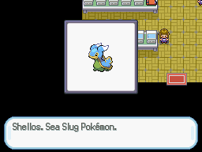

# Show Species Introduction
This script is for Pokémon Essentials. It shows a picture with the pokémon species in a border together with a message containing the name and kind, play it's cry and mark it as seen in pokédex. Good to make the starter selection event.

## Screens

## Installation
Follow the [Script](/Script.rb) instructions.